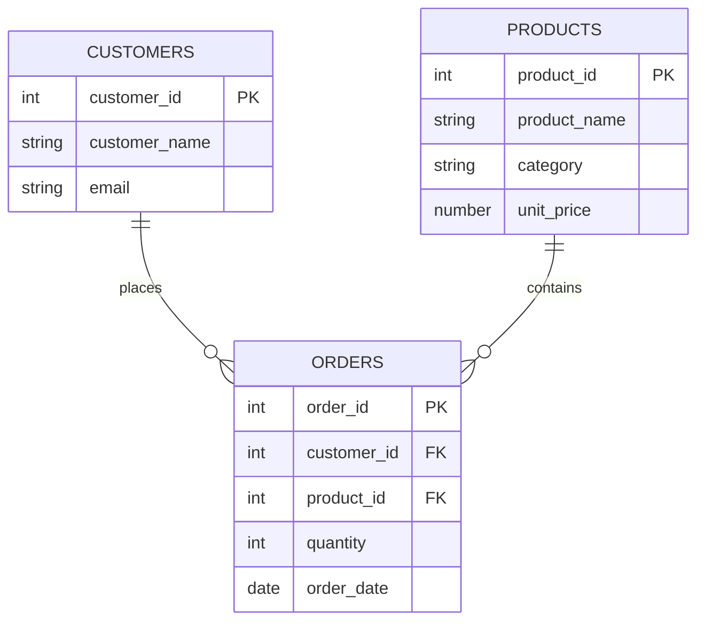
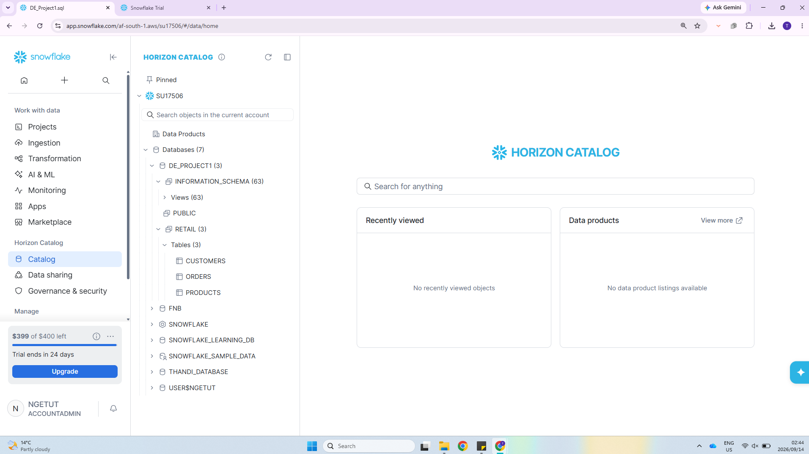
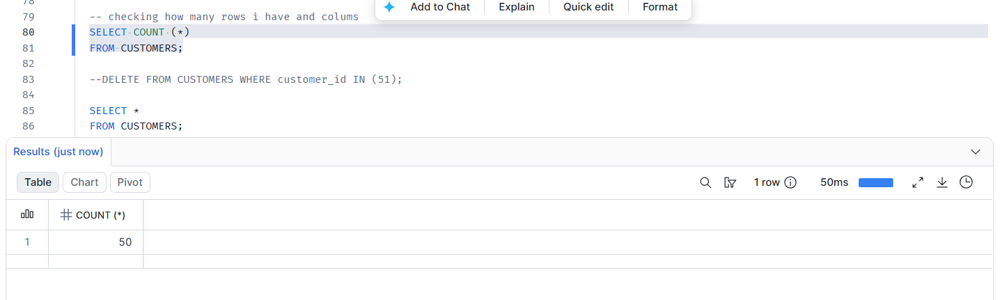
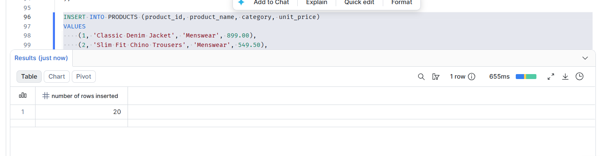
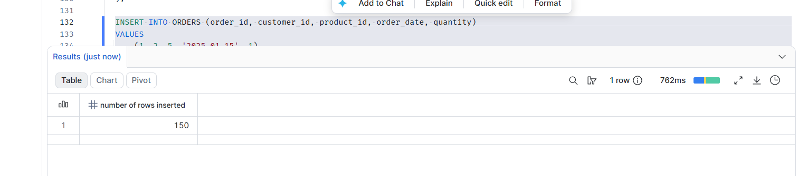

# Data Engineering Project 1: Snowflake Relational Database & Retail Analytics


## Table of Contents

- [Project Overview](#project-overview)
- [Database Architecture & Schema](#database-architecture--schema)
- [Repository Structure & Contents](#repository-structure--contents)
- [Validation Screenshots](#validation-screenshots)
- [Executed Analytical Queries](#executed-analytical-queries)
- [Technical Learnings Applied](#technical-learnings-applied)

---

## Project Overview
This repository contains the foundational database engineering and analytics work completed for **Project 1**.
This project serves as a prerequisite blueprint for the upcoming Capstone module (`BrightLearn_Snowflake_Capstone.md`).

The objective was to design a relational schema within Snowflake, populate tables with synthetically generated datasets, execute multi-table joins, and calculate business-critical retail performance metrics.

---

## Database Architecture & Schema
The relational model consists of three core tables linked together using Primary and Foreign key logic:

1. **CUSTOMERS Table**: Tracks customer profiles.
   - *Key Modification*: The dataset intentionally sets `customer_id` starting from `1` through `50` to represent exactly 50 active consumer accounts. Email domains were normalized to `@gmail.com`.
2. **PRODUCTS Table**: Contains 20 unique apparel stock items across 5 clothing categories (*Menswear, Womenswear, Activewear, Accessories, and Outerwear*) with explicit `NUMBER(10,2)` decimal formatting for exact financial calculations.
3. **ORDERS Table**: A transactional table tracking 150 unique customer order records spread across dates in 2025 and early 2026.



---

## Repository Structure & Contents

```text
brightlearn_snowflake_DE_project1/
├── data_csv/
│   ├── DE_Project1_customers.csv   # 50 cleansed customer profile rows
│   ├── DE_Project1_products.csv    # Product inventory & category divisions
│   ├── DE_Project1_orders.csv      # Ingested retail transactions
│   ├── DE_Project1_query1.csv      # Output: transactional invoicing
│   ├── DE_Project1_query2.csv      # Output: customer lifetime value
│   ├── DE_Project1_query3.csv      # Output: category performance
│   └── DE_Project1_query4.csv      # Output: top 5 VIP spenders
├── sql_scripts/
│   ├── 01_createdb.sql             # Database creation
│   ├── 02_createtable.sql          # Table definitions & keys
│   ├── 03_load_data.sql            # Data staging & load
│   ├── 04_total_revenue_per_customer.sql
│   └── queries.sql                 # Full analytical query set
├── images/                         # Snowflake worksheet validation screenshots
└── README.md
```

- **`data_csv/`**: Cleansed source datasets plus the exported results of each analytical query.
- **`sql_scripts/`**: Production-ready SQL covering database/table creation, data loading, and analytics.
- **`images/`**: Visual console verifications proving successful table populations, row counts, and structural integrity directly inside Snowflake worksheet environments.

---

## Validation Screenshots

### Database Schema & Tables



### Customers Table Row Count



### Products Table Row Count



### Orders Table Row Count



---

## Executed Analytical Queries

### Query 1: Granular Transactional Invoicing
Joins all three tables to construct a complete transactional view including a dynamically calculated line item revenue metric (`quantity * unit_price`).
```sql
SELECT 
    o.order_id,
    c.customer_name,
    p.product_name,
    p.category,
    o.quantity,
    p.unit_price,
    (o.quantity * p.unit_price) AS line_revenue,
    o.order_date
FROM ORDERS o
JOIN CUSTOMERS c ON o.customer_id = c.customer_id
JOIN PRODUCTS p ON o.product_id = p.product_id
ORDER BY o.order_id;
```

### Query 2: Aggregate Customer Lifetime Value (CLV)
Aggregates sales performance across individual user accounts and tracks consumer spending habits sorted from highest to lowest.
```sql
SELECT 
    c.customer_id,
    c.customer_name,
    c.email,
    SUM(o.quantity * p.unit_price) AS total_revenue
FROM CUSTOMERS c
JOIN ORDERS o ON c.customer_id = o.customer_id
JOIN PRODUCTS p ON o.product_id = p.product_id
GROUP BY c.customer_id, c.customer_name, c.email
ORDER BY total_revenue DESC;
```

### Query 3: Departmental & Category Performance
Evaluates macro-level corporate performance metrics by grouping total units sold and financial earnings by distinct product divisions.
```sql
SELECT 
    p.category,
    SUM(o.quantity) AS total_units_sold,
    SUM(o.quantity * p.unit_price) AS total_revenue
FROM PRODUCTS p
JOIN ORDERS o ON p.product_id = o.product_id
GROUP BY p.category
ORDER BY total_revenue DESC;
```

### Query 4: VIP Buyer Isolation (Top 5 Spenders)
Uses filter constraints (`LIMIT 5`) to isolate high-value consumer groups for targeted marketing campaigns.
```sql
SELECT 
    c.customer_id,
    c.customer_name,
    SUM(o.quantity * p.unit_price) AS total_spend
FROM CUSTOMERS c
JOIN ORDERS o ON c.customer_id = o.customer_id
JOIN PRODUCTS p ON o.product_id = p.product_id
GROUP BY c.customer_id, c.customer_name
ORDER BY total_spend DESC
LIMIT 5;
```

---

## Technical Learnings Applied

- **Snowflake Constraint Behavior**: Acknowledged and verified that Snowflake does not enforce `PRIMARY KEY` or `FOREIGN KEY` validity at runtime. Data integrity was instead verified during compilation and staging phases.
- **Git/Version Control Troubleshooting**: Successfully resolved local user directory conflicts, directory tree overrides via custom `OneDrive` configuration pipelines, and synchronized Git merge rebases (`index.lock` remediation) utilizing Git Bash and VS Code.
